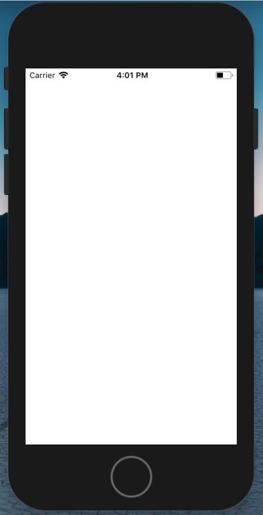
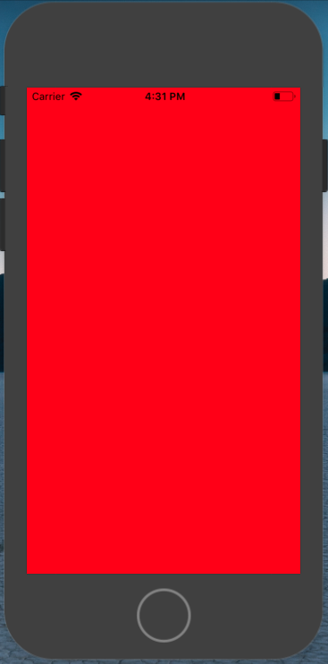
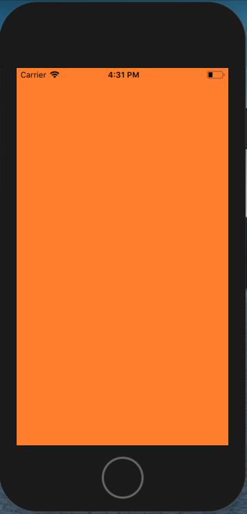
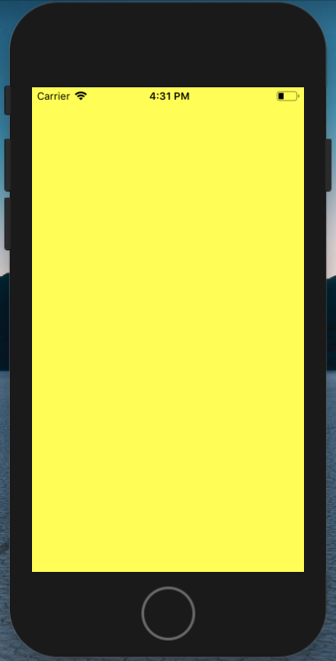
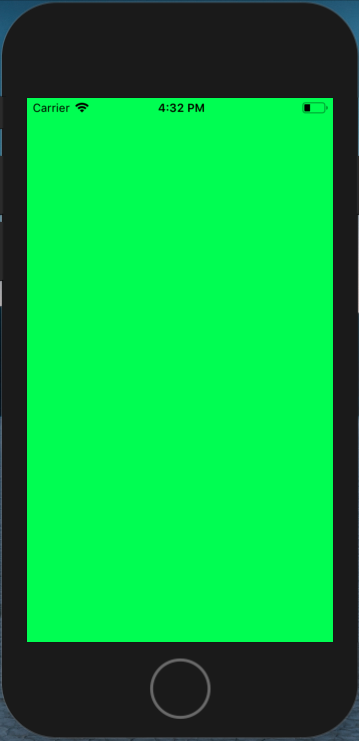
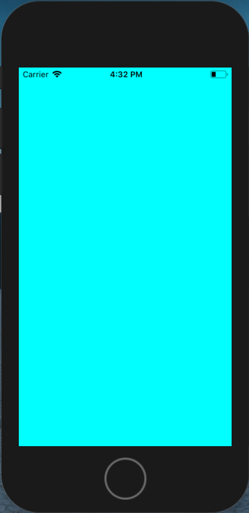
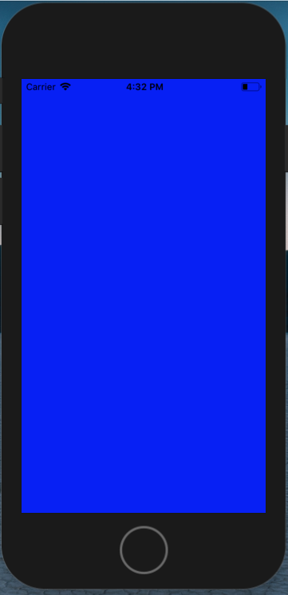
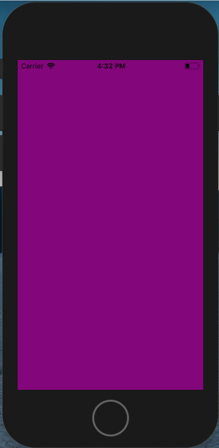
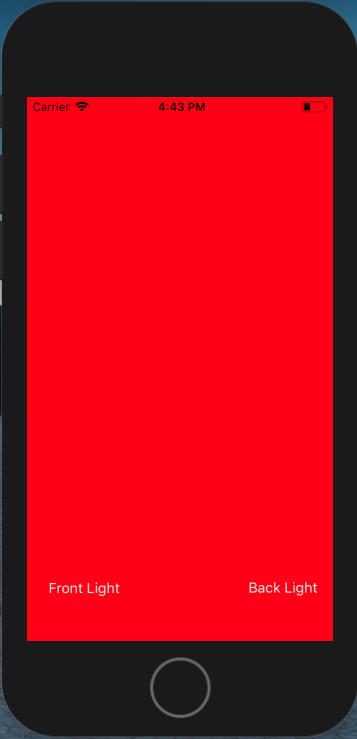
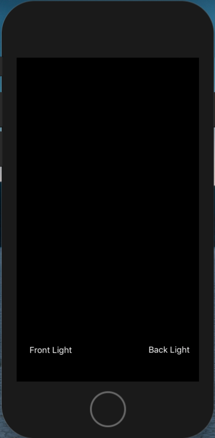

# Unit 1: Light
### by Suzan Zuurmond (10791167)
End project of Unit 1. For fun, two other versions of apps involving light were added. One which can function as a bicycle light, and one that switches between different colours using a switch-case.

## Light
This light app is very simplistic: by clicking on the screen you'll switch from a white background to a black one.

 

## Extras
### Color Light
In this app some colors are added: by clicking on the screen you'll switch through all colors of the rainbow.

      

### Bicycle light
This is a more practical app that you can use on your bike. It gives you the ability of turning a front- (the flaslight) and backlight (the screen) on and off when you push the corresponding buttons. Here you see the use of the backlight:

 
